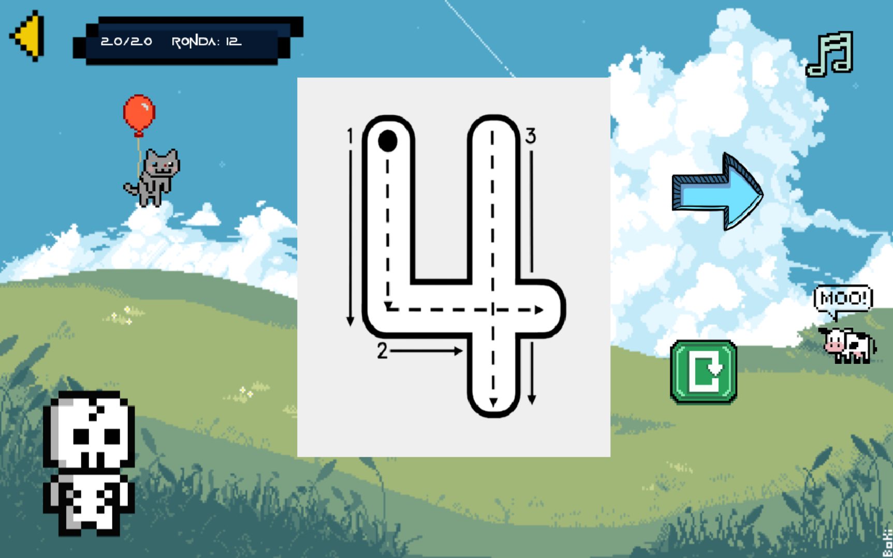
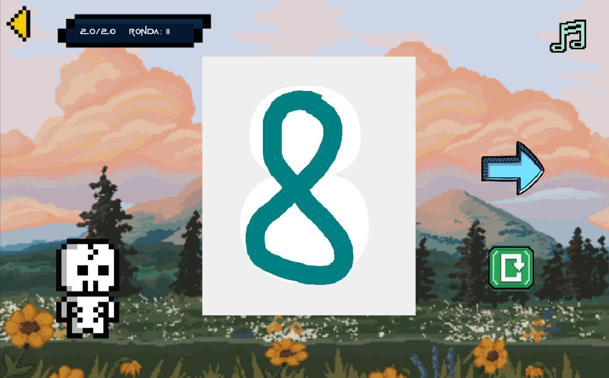
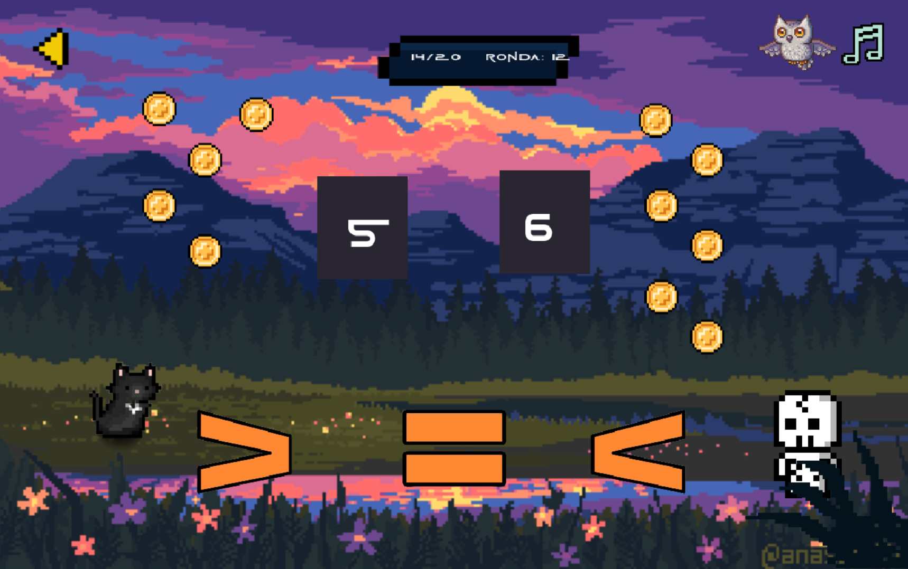
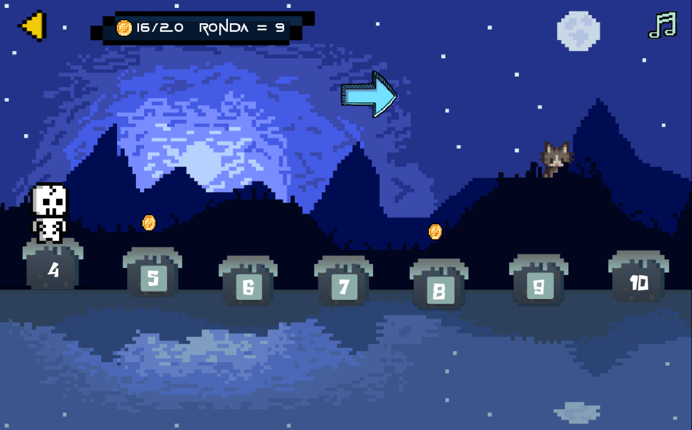
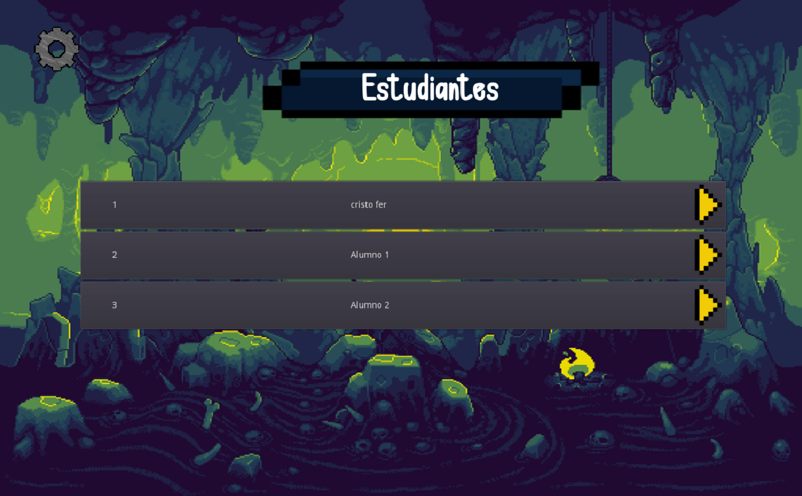

# SPOO GAME
This is a small group project, carried out in the software engineering course, with the purpose of making an educational video game to teach addition to children who can't read yet. Thanks for reading

---

## 🖥️ Technologies
This project is powered by:

- **Godot Engine 3.x** – The video game engine used for development
- **GDScript** – The programming language used by the video game engine

---

## 🎮 Gameplay
This video game is oriented to children, therefore, the levels presented are based on practicing certain skills to improve their learning.

- LEVEL 1:
In level 1, the children will learn to understand quantities by selecting the respective flows to be pushed by Spoo.


- LEVEL 2:
In level 2, we must teach the child to be able to draw the corresponding numbers, between 1 and 9, there is also sound to indicate which number it is and lines to guide him/her.


- LEVEL 3:
In level 3 is an adaptation of the previous level. It shows a white space with a very low indicator for the user to practice.


- LEVEL 4:
Level 4 teaches the user to understand quantities, with greater than (>), less than (<) and equal to (=) signs. Also showing quantities that make the child able to count.


- LEVEL 5:
Level 5 is the last spoo adventure. Spoo will jump over the blocks to get to the other side, but the blocks must follow the sequence, so the child will understand how the numbers are placed.


---

## ✨ Features

- 1: In this small video game, we can collect coins to evaluate the student's performance
- 2: There is an admin side to create a session of one or more students, it was thought that the teacher in charge of the children perform this management

The user and password is: admin. We can also list the students

- 3: Spoo, has sounds implemented with voices in Spanish.

## ⚙️ Installation

Clone this repository and run the app locally with just a few commands:

```bash
git clone https://github.com/Luis3Fernando/Spoo-Game
```
```bash
cd Spoo-Game
```
You must open godot engine to manage the code, it is Open Source, but with distribution license because this work contains a scientific publication.

