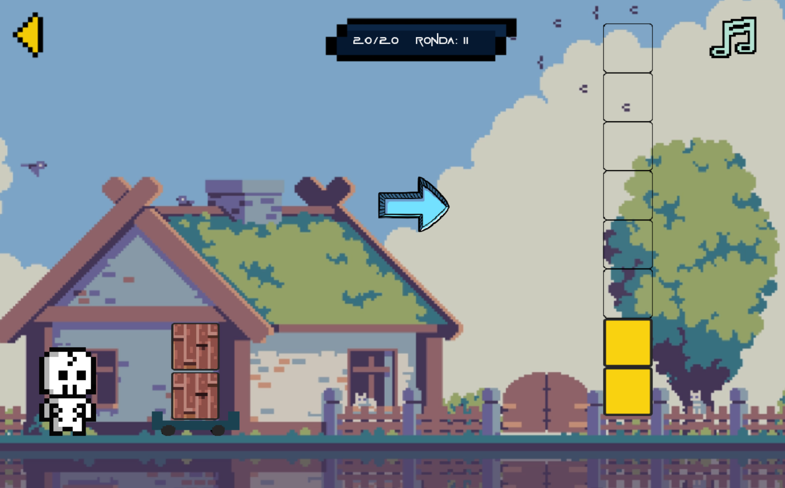

# SPOO GAME
This is a small group project, carried out in the software engineering course, with the purpose of making an educational video game to teach addition to children who can't read yet. Thanks for reading

## 🖥️ Technologies
This project is powered by:

- **Godot Engine 3.x** – The video game engine used for development
- **GDScript** – The programming language used by the video game engine

## 🎮 Gameplay
This video game is oriented to children, therefore, the levels presented are based on practicing certain skills to improve their learning.

- LEVEL 1:
In level 1, the children will learn to understand quantities by selecting the respective flows to be pushed by Spoo.

---
